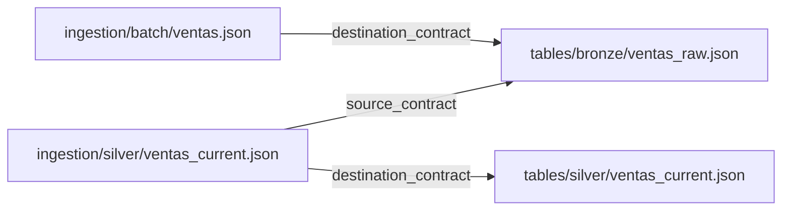

# Contratos

Los contratos son archivos JSON que describen tu lakehouse. Hay dos tipos y es
importante no confundirlos.

| Tipo | Dónde vive | Qué describe | Lo carga |
|---|---|---|---|
| Contrato de tabla | `tables/{bronze,silver,gold}/*.json` | Schema, particiones, permisos y propiedades Delta de una tabla | `ContractLoader` |
| Contrato de ingesta | `ingestion/{batch,streaming,silver}/*.json` | De dónde vienen los datos, a qué tabla van y con qué estrategia | `IngestionContractLoader` |

Dicho de otra forma: el contrato de tabla responde a "cómo es esta tabla" y el de
ingesta a "cómo se llena".

## Cómo se relacionan

Un contrato de ingesta apunta a uno o dos contratos de tabla mediante rutas relativas:

```json title="ingestion/silver/ventas_current.json"
{
  "name":                 "ventas_current",
  "strategy":             "cdc_merge",
  "source_contract":      "../../tables/bronze/ventas_raw.json",
  "destination_contract": "../../tables/silver/ventas_current.json",
  "merge_keys":           ["venta_id"]
}
```



!!! note "Las rutas se resuelven desde el propio JSON"

    `../../tables/bronze/ventas_raw.json` se interpreta respecto a la carpeta donde está
    el contrato de ingesta, no respecto al directorio desde el que ejecutas el pipeline.

## Reglas comunes

- Ambos tipos aceptan los mismos placeholders: `{catalog.<capa>}`, `{path.<nombre>}`,
  `{env}` y `{env_short}`.
- Puedes añadir una clave `_doc` con un comentario. Los loaders la ignoran.
- Las dataclasses resultantes (`TableContract`, `IngestionContract`) son inmutables.
  Créalas siempre con los loaders.

## Validación

El repositorio incluye JSON Schema para ambos tipos en la carpeta `schema/`. Úsalos
como referencia al escribir contratos nuevos y valídalos antes de hacer commit:

```bash
python scripts/validate_contracts.py
```

Si tu editor soporta JSON Schema, asociar esos archivos te dará autocompletado y avisos
mientras escribes.

## Dónde seguir

- Campos de un contrato de tabla: [Gobierno de tablas](../governance/index.md).
- Campos de un contrato de ingesta: [Carga batch](../ingestion/batch.md) y
  [Promoción a Silver](../ingestion/silver.md).
