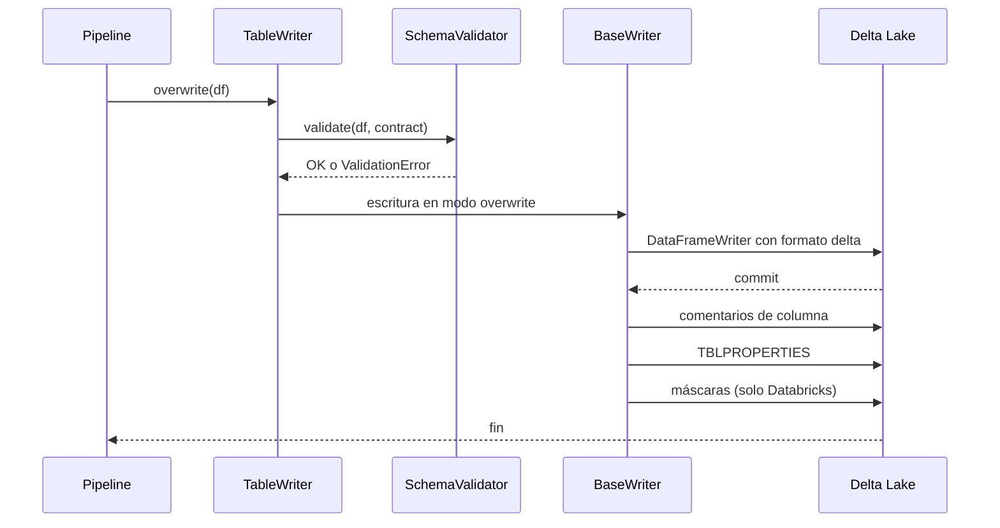
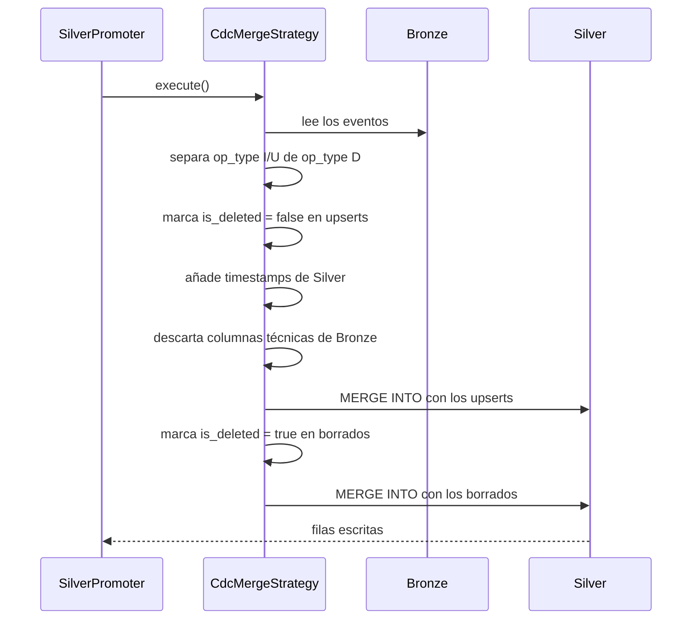

# Flujos internos

Esta página describe lo que ocurre por dentro en las dos operaciones más habituales.
No hace falta conocerlo para usar DKOps, pero ayuda mucho al depurar.

## Una escritura con TableWriter

1. El validador compara el DataFrame con el contrato. Si falta una columna obligatoria o
   un tipo no es compatible, la escritura se detiene antes de tocar la tabla.
2. El writer escribe los datos con el modo que corresponda a la operación.
3. Después aplica la metadata del contrato: comentarios, propiedades, máscaras y
   permisos. Estos dos últimos solo tienen efecto en Databricks.

## Una promoción a Silver con cdc_merge

Todas las estrategias siguen el mismo esqueleto:

1. Leen Bronze, completo o filtrado.
2. Deduplican por `merge_keys` quedándose con el registro más reciente según
   `watermark_col`.
3. Aplican su lógica de escritura.
4. Filtran las columnas para que `_ingested_at` o `_source_file` no lleguen a Silver.
5. Añaden `_silver_created_at` y `_silver_modified_at` si el contrato lo pide.

## Tres caminos para crear una tabla

Una tabla puede nacer por tres vías distintas y solo una emite `CREATE TABLE`:

| Camino | Cómo se crea | Metadata del contrato |
|---|---|---|
| `TableWriter.overwrite()` | `CREATE OR REPLACE TABLE` y `saveAsTable` | Se aplica al terminar |
| Primera carga de `TableWriter.upsert()` | `saveAsTable` en modo overwrite | Se aplica al terminar |
| Escritura streaming de `BronzeIngestor` | `writeStream.toTable()` | Se aplica al terminar |

Los tres terminan llamando a `apply_contract_metadata()`, que es idempotente. Así los
comentarios, las máscaras y los permisos quedan aplicados sin importar el camino.

!!! note "Límite de la vía streaming"

    Auto Loader infiere el schema desde los archivos, de modo que la tabla puede incluir
    columnas que el contrato no declara, como `_rescued_data` o columnas de partición
    deducidas de la ruta. La metadata se aplica a lo que el contrato declara, pero no
    elimina lo que sobra.
