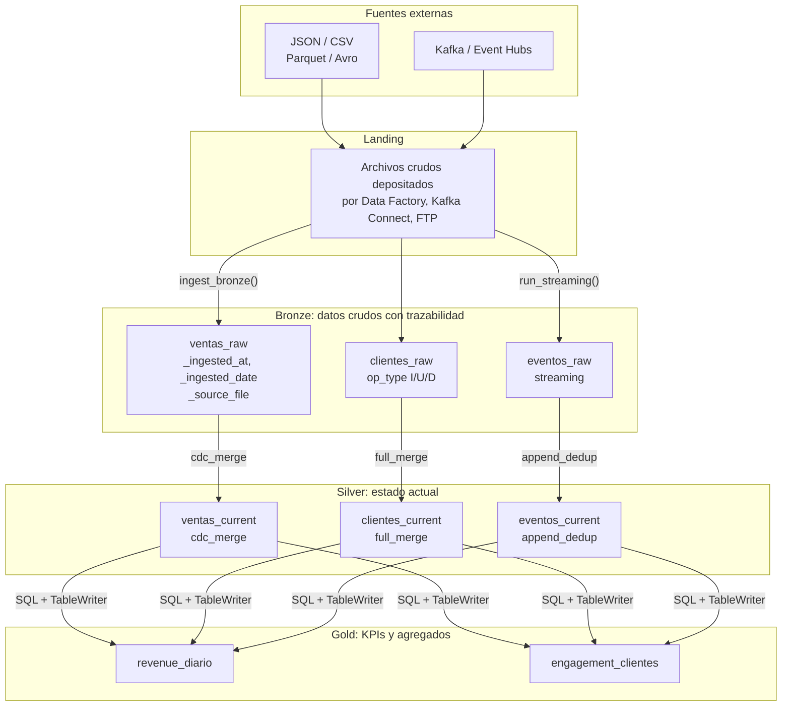

# Arquitectura

DKOps implementa la arquitectura Medallion con un motor que separa la configuración del
comportamiento: los contratos dicen qué hacer y el framework decide cómo hacerlo en el
runtime donde esté corriendo.

## Vista general

## Las cuatro capas

| Capa | Qué contiene | Quién escribe | Cómo se mantiene idempotente |
|---|---|---|---|
| Landing | Archivos tal como los deja el sistema de origen | Procesos externos | No aplica |
| Bronze | Los mismos datos más columnas técnicas de ingesta | `BronzeIngestor` | Sobrescribe la partición `_ingested_date` del día |
| Silver | Última versión de cada entidad, deduplicada por clave | `SilverPromoter` | Upsert por `merge_keys` |
| Gold | Métricas y agregados para consumo | Tu SQL con `TableWriter` | Normalmente `overwrite` |

## Tres ideas que atraviesan el framework

**Los contratos son la fuente de verdad.** Ni el nombre de una tabla ni su schema se
escriben en el código Python. Todo sale de un JSON que se revisa en un pull request como
cualquier otro cambio.

**El pipeline no sabe dónde corre.** `Launcher` detecta el runtime una sola vez y el
resto de componentes lo consulta con `Launcher.current()`. Por eso los writers y readers
solo reciben el contrato.

**Repetir una ejecución no rompe nada.** Cada capa tiene un mecanismo de escritura que
produce el mismo resultado si se lanza dos veces con los mismos datos.

## En esta sección

- [Módulos](modules.md): qué hace cada paquete y cómo se relacionan.
- [Contratos](contracts.md): la diferencia entre contratos de tabla y de ingesta.
- [Flujos internos](flows.md): qué ocurre paso a paso en una escritura y en una promoción.
- [Local y Databricks](runtime.md): cómo se resuelven catálogos, rutas y readers.
