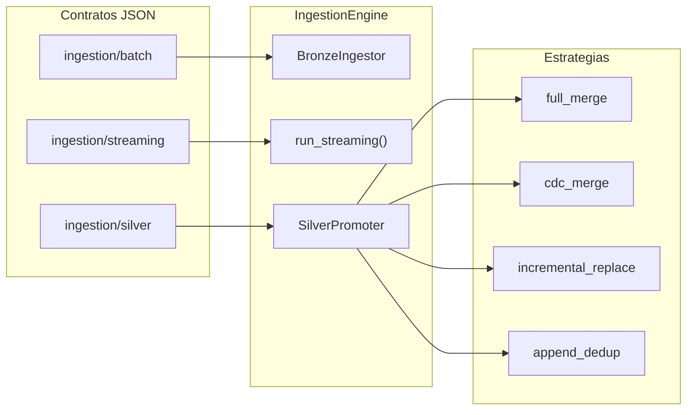

# Módulos

El paquete se divide en un núcleo pequeño y dos módulos funcionales.

```
src/DKOps/
├── launcher.py              crea la SparkSession y el EnvironmentConfig
├── environment_config.py    resuelve catálogos, rutas y entorno
├── logger_config.py         AppLogger y LoggableMixin
├── ingestion/               de Landing a Silver
└── table_governance/        contratos, escritura, lectura y migraciones
```

## Núcleo

| Componente | Responsabilidad |
|---|---|
| `Launcher` | Punto de entrada. Detecta el runtime, crea la `SparkSession` y queda registrado como singleton del proceso. |
| `EnvironmentConfig` | Lee `config.json` y resuelve placeholders como `{catalog.bronze}` o `{path.silver}` para el entorno activo. |
| `AppLogger` y `LoggableMixin` | Logging estructurado con Loguru. Cualquier clase que herede del mixin obtiene `self.log`. |

## Ingesta

```
ingestion/
├── engine.py                IngestionEngine, el orquestador
├── bronze_ingestor.py       Landing a Bronze
├── silver_promoter.py       Bronze a Silver
├── contracts/               IngestionContract y su loader
├── readers/                 lectores de fuentes y su factory
├── strategies/              las cuatro estrategias de promoción
├── enrichment/metadata.py   columnas técnicas de ingesta
└── ops/ops_logger.py        tabla de control operativo
```



| Componente | Responsabilidad |
|---|---|
| `IngestionEngine` | Carga los contratos y expone `ingest_bronze()`, `run_streaming()`, `promote_silver()` y `status()`. |
| `BronzeIngestor` | Lee la fuente, añade columnas técnicas y escribe en Bronze. |
| `SilverPromoter` | Lee Bronze y delega la escritura en la estrategia del contrato. |
| `SourceReaderFactory` | Elige el reader adecuado según el formato y el runtime. |
| `MetadataEnricher` | Añade `_ingested_at`, `_ingested_date` y `_source_file`. |
| `IngestionOpsLogger` | Registra el inicio y el cierre de cada dataset en una tabla Delta. |

## Gobierno de tablas

```
table_governance/
├── contracts/
│   ├── loader.py            TableContract, ContractLoader y load_contract()
│   └── validator.py         SchemaValidator
├── writers/
│   ├── table_writer.py      fachada pública
│   ├── base_writer.py       lógica común: runtime, merge_schema, máscaras
│   ├── create_writer.py     CREATE OR REPLACE TABLE
│   ├── append_writer.py     INSERT INTO
│   ├── upsert_writer.py     MERGE INTO
│   ├── partition_writer.py  sobrescritura de una partición
│   └── delete_writer.py     DELETE WHERE
├── readers/table_reader.py  TableReader
└── migrations/
    └── safe_migrator.py     plan de cambios sin pérdida de datos
```

| Componente | Responsabilidad |
|---|---|
| `TableContract` | Dataclass inmutable con el estado deseado de una tabla. La construye el loader, nunca se instancia a mano. |
| `SchemaValidator` | Compara los tipos y la nulabilidad del DataFrame con el contrato. Admite ampliación de tipos. |
| `TableWriter` | `overwrite`, `append`, `upsert`, `overwrite_partition`, `delete` y `apply_contract_metadata`. |
| `TableReader` | `read`, `read_partition`, `read_stream` y `read_cdf`. |
| `SafeMigrator` | Compara contrato y tabla real, y genera un plan de `ALTER TABLE` seguro. |
