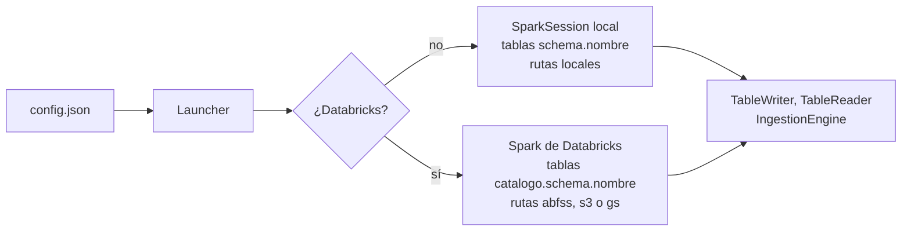

# Local y Databricks

El mismo `pipeline.py` corre en tu equipo y en un job de Databricks. Esta página explica
qué cambia por debajo.

## Detección del runtime

`Launcher` se crea una sola vez al inicio del proceso. A partir de ahí los writers,
readers, ingestors y el `SafeMigrator` obtienen la sesión de Spark y la configuración con
`Launcher.current()`. Por eso sus constructores solo piden el contrato.

## Qué cambia entre entornos

| Aspecto | Local | Databricks |
|---|---|---|
| Nombre de tabla | `schema.nombre` | `catalogo.schema.nombre` |
| Catálogo | Se ignora | Se resuelve con `{catalog.<capa>}` |
| Rutas | Carpetas locales, por ejemplo `/tmp/...` | Almacenamiento cloud |
| Máscaras de columna | Se omiten sin error | `ALTER COLUMN ... SET MASK` |
| Permisos | Se omiten sin error | `GRANT` y `DENY` |
| Lectura batch de Landing | `LocalBatchReader` | `AutoLoaderReader` |
| Lectura streaming de Landing | `FileStreamReader` | `AutoLoaderReader` |
| Kafka | `KafkaReader` | `KafkaReader` |

Para escribir SQL que funcione en ambos entornos, usa `contract.effective_name` en lugar
de escribir el nombre de la tabla a mano.

## Selección de readers

`SourceReaderFactory` aplica tres reglas, en este orden:

1. Si `source.format` es `kafka`, usa `KafkaReader`.
2. Si la ingesta es streaming, usa Auto Loader en Databricks y `FileStreamReader` en local.
3. Si es batch, usa Auto Loader en Databricks y `LocalBatchReader` en local.

Con Databricks Connect, desde tu equipo contra un cluster remoto, se usan los readers
locales para archivos y `KafkaReader` para Kafka.

Los readers específicos de Databricks se importan de forma diferida, así que el módulo
se puede importar en local sin tener instaladas sus dependencias.
