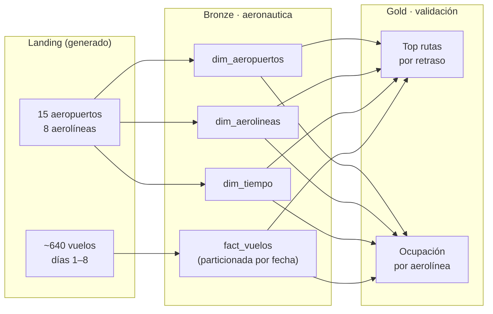

# Demo 1 — Aeronáutica

**Dominio:** operaciones aéreas · **Foco:** escritores gobernados + SafeMigrator

Demo de referencia del framework DKOps: define cuatro tablas mediante contratos JSON y ejercita los cinco writers (`overwrite`, `append`, `upsert`, `overwrite_partition`, `delete`) más el `SafeMigrator` sobre un dominio aeronáutico simulado.

```bash
python demos/demo_1/pipeline.py
```

---

## Flujo de datos



!!! info "Arquitectura de este demo"
    Demo 1 usa directamente `TableWriter` sin el `IngestionEngine`. Demuestra los writers de tabla en estado puro, sin la capa de ingesta. Los datos se generan en memoria y se escriben directamente a las tablas.

---

## Modelo de datos

Esquema en estrella — una fact particionada por fecha y tres dimensiones.

```
        ┌──────────────────┐
        │  dim_aeropuertos │   15 aeropuertos (Colombia + LATAM + EEUU + EU)
        │  PK: iata_code   │
        └────────┬─────────┘
                 │ iata_origen / iata_destino
                 ▼
┌────────────┐  fact_vuelos  ┌──────────────────┐
│ dim_tiempo │◄──────────────┤  fact_vuelos     │
│ PK: fecha  │  fecha        │  particionada    │
└────────────┘               │  por fecha       │
                             │  PK: vuelo_id    │
                             └────────┬─────────┘
                                      │ iata_aerolinea
                                      ▼
                             ┌──────────────────┐
                             │  dim_aerolineas  │   8 aerolíneas
                             │  PK: iata_code   │
                             └──────────────────┘
```

---

## Las 6 fases del pipeline

| Fase | Operación | Writer |
|---|---|---|
| 1 — Bootstrap | Crea las 4 tablas + 7 días de vuelos | `overwrite` + `append` |
| 2 — Día 8 | Vuelos nuevos + corrección de retrasos + Viva Air → inactiva | `append` + `upsert` |
| 3 — Reproceso | Regenera solo la partición `fecha = día 5` | `overwrite_partition` |
| 4 — Limpieza | Inserta vuelos corruptos y los elimina | `append` + `delete` |
| 5 — Schema | Compara contrato vs tabla real | `SafeMigrator(dry_run=True)` |
| 6 — Validación | 5 queries de negocio cruzando fact y dims | SQL |

---

## Qué demuestra

| Concepto | Cómo se ve |
|---|---|
| Contratos con placeholders | `{catalog.bronze}`, `{path.bronze}` en `tables/*.json` |
| Runtime local ↔ Databricks | El mismo `pipeline.py` sin cambios |
| `overwrite` | Fase 1 — crea la tabla desde cero |
| `append` | Fases 1 y 2 — días siguientes |
| `upsert` — MERGE INTO | Fase 2 — corrección de vuelos + estado aerolínea |
| `overwrite_partition` | Fase 3 — reproceso de un día específico |
| `delete` — SQL condition | Fase 4 — elimina vuelos con `distancia_km = 0` |
| `SafeMigrator` dry_run | Fase 5 — plan sin ejecutar |
| `effective_name` en SQL | `FROM {contract.effective_name}` — no hardcoding |

---

## Estructura

```
demos/demo_1/
├── pipeline.py              # orquestador — 6 fases
├── config/
│   └── config.json
├── datagen/
│   ├── main.py
│   ├── generate_aeropuertos.py
│   └── generate_vuelos.py
└── tables/
    ├── dim_aeropuertos.json
    ├── dim_aerolineas.json
    ├── dim_tiempo.json
    └── fact_vuelos.json
```

---

## Salida esperada

```
┌──────────────────────────────────────────────┐
│           RESUMEN DEL LAKEHOUSE              │
├──────────────────────────────────────────────┤
│  Aeropuertos en dim     :     15             │
│  Aerolíneas en dim      :      8             │
│  Días en calendario     :      7             │
│  Total vuelos (fact)    :   ~640             │
│  Días con vuelos        :      8             │
│  Retraso prom. global   :  ~12.5 min         │
│  Ocupación prom. global :  ~78.3 %           │
└──────────────────────────────────────────────┘

✔ Pipeline completado exitosamente
```

---

## Idempotencia

El demo es completamente idempotente. La Fase 1 hace `CREATE OR REPLACE` dejando el lakehouse en estado limpio en cada arranque — puedes correrlo múltiples veces sin limpiar nada manualmente.
