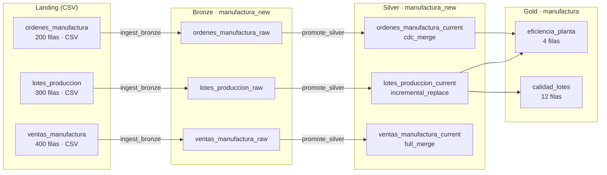

# Demo 2 — Manufactura

**Dominio:** manufactura de artículos de aseo · **Foco:** DQ declarativo + transformaciones testeables + IngestionEngine

Pipeline de 3 capas con datos intencionalmente sucios, funciones puras de transformación testeables con `pytest`, y un motor de Data Quality declarativo que valida cada capa.

```bash
python demos/demo_2/pipeline.py
```

---

## Flujo de datos



---

## Modelo de datos

```
        BRONZE (raw, datos sucios)               SILVER (limpio, tipado)        GOLD (KPIs)
┌─────────────────────────────┐    ┌─────────────────────────────┐    ┌─────────────────────────┐
│  lotes_produccion_raw       │ ─► │  lotes_produccion_current   │ ─► │  eficiencia_planta      │
│  (QC vacío, pH out-of-range)│    │  (QC normalizado, merma)    │    │  (diaria por línea)     │
├─────────────────────────────┤    ├─────────────────────────────┤    ├─────────────────────────┤
│  ordenes_manufactura_raw    │ ─► │  ordenes_manufactura_current│ ─► │  calidad_lotes          │
│  (estados sucios, dups)     │    │  (estado normalizado, dedup)│    │  (mensual por producto) │
├─────────────────────────────┤    ├─────────────────────────────┤    └─────────────────────────┘
│  ventas_manufactura_raw     │ ─► │  ventas_manufactura_current │
│  (CANCELLED, devoluciones)  │    │  (solo CONFIRMED+RETURNED)  │
└─────────────────────────────┘    └─────────────────────────────┘
```

---

## Qué demuestra

| Concepto | Dónde se ve |
|---|---|
| `IngestionEngine` batch (CSV) | `pipeline.py` fases 1–3 |
| Estrategia `incremental_replace` | `lotes_produccion` |
| Estrategia `cdc_merge` (I/U/D) | `ordenes_manufactura` |
| Estrategia `full_merge` | `ventas_manufactura` |
| Transformaciones puras testeables | `transformations/` |
| Motor DQ declarativo | `dq/dq_engine.py` + `dq/rules.py` |
| DQ con severidades `error` / `warning` | Fase post-escritura Silver |
| Unit tests con pytest | `tests/` (35 tests, sin Delta) |
| Datos sucios a propósito | casing inconsistente, dups, nulos, pH fuera de rango |

---

## Motor DQ declarativo

Las reglas se definen como diccionarios y se ejecutan automáticamente tras cada escritura:

```python
{"type": "not_null",   "columns": ["lote_id", "linea_produccion"]}
{"type": "unique",     "columns": ["lote_id"]}
{"type": "in_set",     "column": "estado_qc", "allowed": ["APROBADO", "RECHAZADO", "PENDIENTE"]}
{"type": "range",      "column": "ph_valor", "min": 5.0, "max": 9.0, "severity": "warning"}
{"type": "expression", "name": "merma_no_negativa",
 "expression": "merma_kg IS NULL OR merma_kg >= 0"}
```

Salida del reporte DQ:

```
DQ Report — silver.manufactura_new.lotes_produccion_current (6 regla(s)):
────────────────────────────────────────────────────────────────────────
  ✔ [error  ] not_null(lote_id, ...)              failed=    0/300 (  0.0%)
  ✔ [error  ] unique(lote_id)                     failed=    0/300 (  0.0%)
  ⚠ [warning] range(ph_valor ∈ [5.0, 9.0])       failed=    4/300 (  1.3%)
────────────────────────────────────────────────────────────────────────
Status: PASSED (con warnings) | errors=0 | warnings=1
```

---

## Tests unitarios

```bash
cd demos/demo_2
pytest tests/ -v          # ~35 tests, sin Delta, sin catálogo
```

Las funciones de transformación en `transformations/` son puras — reciben DataFrames, devuelven DataFrames, sin I/O. Esto las hace triviales de testear:

```python
def test_normaliza_estado(spark):
    df = spark.createDataFrame([("completed",), ("OK",)], ["estado"])
    result = normalizar_estado_orden(df).collect()
    assert all(r.estado == "COMPLETED" for r in result)
```

---

## Estructura

```
demos/demo_2/
├── pipeline.py                     # orquestador end-to-end
├── config/
│   └── config.json
├── datagen/
│   ├── main.py
│   ├── generate_lotes.py
│   ├── generate_ordenes.py
│   └── generate_ventas.py
├── ingestion/
│   ├── batch/                      # contratos Landing → Bronze
│   └── silver/                     # contratos Bronze → Silver
├── tables/
│   ├── bronze_new/                 # contratos tabla Bronze
│   ├── silver_new/                 # contratos tabla Silver
│   └── gold/                       # contratos tabla Gold
├── transformations/
│   ├── bronze_to_silver.py         # funciones puras de limpieza
│   └── silver_to_gold.py           # funciones puras de agregación
├── dq/
│   ├── dq_engine.py                # Rule, RuleSet, DQReport
│   └── rules.py                    # reglas declarativas por tabla
└── tests/
    ├── conftest.py                 # fixture SparkSession (scope=session)
    ├── test_bronze_to_silver.py
    ├── test_silver_to_gold.py
    └── test_dq_engine.py
```
