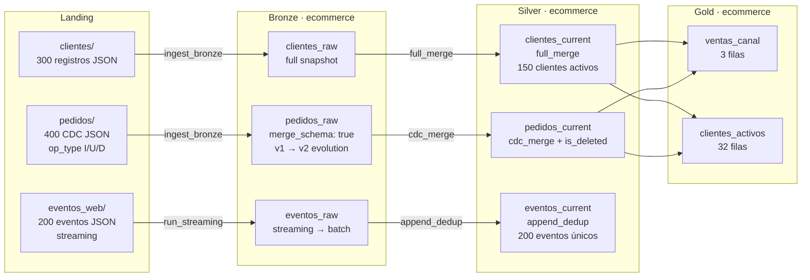

# Demo 3 — E-commerce

**Dominio:** e-commerce · **Foco:** `merge_schema` + column masking + streaming + 3 estrategias Silver

Pipeline Lakehouse completo con schema evolution automática, enmascaramiento de columnas sensibles (email), streaming de clickstream y las tres estrategias principales de promoción Silver.

```bash
python demos/demo_3/pipeline.py
```

---

## Flujo de datos



---

## Qué demuestra

| Concepto | Dónde se ve |
|---|---|
| `full_merge` — snapshot completo | `clientes_current` |
| `cdc_merge` — CDC I/U/D + soft delete | `pedidos_current` — campo `op_type` |
| `append_dedup` — anti-join append | `eventos_current` — clickstream |
| `merge_schema: true` — schema evolution | `pedidos_raw` — columnas v2 añadidas sin recrear |
| Column masking (`mask`) | `email_cliente` en pedidos y clientes |
| Streaming con `availableNow` | `eventos_web` vía `run_streaming()` |
| Schema auto-inference en streaming | `FileStreamReader` infiere desde archivos estáticos |

---

## Schema evolution (merge_schema)

El contrato `pedidos_raw.json` tiene `"merge_schema": true`. La primera carga escribe pedidos con 8 columnas (v1). La segunda agrega 3 columnas nuevas (v2: `metodo_envio`, `dias_entrega`, `calificacion`):

```json
{
  "properties": {
    "merge_schema": true
  }
}
```

Sin `merge_schema` esto lanzaría `AnalysisException`. Con él, Delta añade las columnas automáticamente y los registros anteriores las tienen como `null`.

---

## Enmascaramiento de columnas

Los contratos de clientes y pedidos declaran `"mask"` en columnas sensibles:

```json
{
  "name":  "email_cliente",
  "type":  "STRING",
  "mask":  "security.mask_email"
}
```

En Databricks / Unity Catalog, tras la escritura se ejecuta automáticamente:

```sql
ALTER TABLE ecommerce.clientes_current
  ALTER COLUMN email SET MASK security.mask_email;
```

En local PC la operación se omite silenciosamente — el pipeline corre sin cambios.

---

## Estructura

```
demos/demo_3/
├── pipeline.py                  # orquestador — 6 fases
├── config/
│   └── config.json
├── datagen/
│   ├── main.py
│   ├── generate_clientes.py     # 300 clientes (50% activos)
│   ├── generate_pedidos.py      # 400 pedidos CDC
│   └── generate_eventos.py      # 200 eventos web
├── ingestion/
│   ├── batch/                   # clientes.json, pedidos.json
│   ├── streaming/               # eventos_web.json
│   └── silver/                  # clientes_current.json, pedidos_current.json, eventos_current.json
└── tables/
    ├── bronze/                  # contratos Bronze
    ├── silver/                  # contratos Silver
    └── gold/                    # ventas_canal.json, clientes_activos.json
```

---

## Gold: ventas y engagement

```sql
-- ventas_canal: revenue por canal
SELECT canal,
       COUNT(*) AS total_pedidos,
       SUM(total) AS revenue_total
FROM silver.ecommerce.pedidos_current
WHERE is_deleted IS NULL OR NOT is_deleted
GROUP BY canal;

-- clientes_activos: clientes con pedidos activos
SELECT c.cliente_id, c.nombre, COUNT(p.pedido_id) AS total_pedidos
FROM silver.ecommerce.clientes_current c
JOIN silver.ecommerce.pedidos_current p ON c.cliente_id = p.cliente_id
WHERE c.activo AND (p.is_deleted IS NULL OR NOT p.is_deleted)
GROUP BY c.cliente_id, c.nombre;
```
