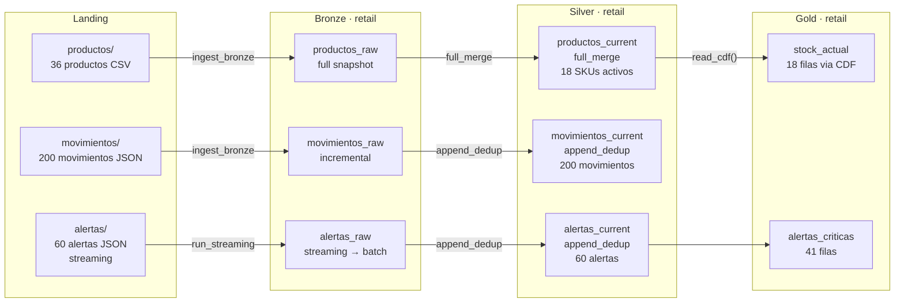

# Demo 4 — Retail / Inventario

**Dominio:** inventario retail · **Foco:** `read_cdf()` + `read_stream()` + `SafeMigrator` + streaming

Pipeline Lakehouse completo para gestión de inventario. Demuestra las capacidades avanzadas de `TableReader`: Change Data Feed, streaming gobernado, y planificación de migraciones con `SafeMigrator`.

```bash
python demos/demo_4/pipeline.py
```

---

## Flujo de datos



---

## Qué demuestra

| Concepto | Dónde se ve |
|---|---|
| `full_merge` — catálogo de productos | `productos_current` |
| `append_dedup` — movimientos sin duplicados | `movimientos_current` |
| `append_dedup` — alertas IoT | `alertas_current` |
| `TableReader.read_cdf()` | Gold: detecta cambios de stock via Change Data Feed |
| `TableReader.read_stream()` | Validación: demo de streaming gobernado |
| `SafeMigrator(dry_run=True)` | Fase 5: plan de migración sin ejecutar |
| Streaming con `availableNow` | `alertas` vía `run_streaming()` |

---

## Change Data Feed — `read_cdf()`

`productos_current` tiene `"change_data_feed": true` en su contrato. Tras las actualizaciones de stock, Gold lee los cambios con:

```python
from DKOps.table_governance import TableReader

reader = TableReader(ct_productos_current)

# Lee solo los cambios desde la versión 1
df_cambios = reader.read_cdf(starting_version=1)

df_cambios.select(
    "producto_id", "stock", "_change_type", "_commit_version"
).show()
```

El DataFrame incluye columnas adicionales de Delta:
- `_change_type`: `insert`, `update_preimage`, `update_postimage`, `delete`
- `_commit_version`: versión Delta del cambio
- `_commit_timestamp`: timestamp del commit

---

## Streaming gobernado — `read_stream()`

```python
stream_df = reader.read_stream()   # isStreaming == True

query = (
    stream_df.writeStream
    .foreachBatch(procesar_alertas)
    .trigger(availableNow=True)
    .start()
)
query.awaitTermination()
```

`TableReader.read_stream()` valida que el contrato de tabla sea compatible con streaming antes de crear el stream.

---

## SafeMigrator — plan de migración

```python
from DKOps.table_governance import SafeMigrator

# Dry run: muestra el plan sin ejecutar nada
plan = SafeMigrator(ct_productos_current, dry_run=True).apply()
```

Compara el contrato JSON contra el estado real de la tabla en Delta y genera el `ALTER TABLE` mínimo necesario. Si el contrato y la tabla están alineados, el plan sale vacío.

---

## Estructura

```
demos/demo_4/
├── pipeline.py                  # orquestador — 6 fases
├── config/
│   └── config.json
├── datagen/
│   ├── main.py
│   ├── generate_productos.py    # 36 SKUs (CSV)
│   ├── generate_movimientos.py  # 200 movimientos (JSON)
│   └── generate_alertas.py      # 60 alertas IoT (JSON)
├── ingestion/
│   ├── batch/                   # productos.json, movimientos.json
│   ├── streaming/               # alertas.json
│   └── silver/                  # productos_current.json, movimientos_current.json, alertas_current.json
└── tables/
    ├── bronze/
    ├── silver/
    └── gold/                    # stock_actual.json, alertas_criticas.json
```

---

## Fases del pipeline

| Fase | Operación | Feature clave |
|---|---|---|
| 0 | Genera datos en Landing | CSV productos + JSON movimientos + JSON alertas |
| 1 | Inicializa DKOps | `Launcher` + `IngestionEngine` |
| 2 | Landing → Bronze | `ingest_bronze()` batch + `run_streaming()` |
| 3 | Bronze → Silver | `promote_silver()` — 3 estrategias |
| 4 | Silver → Gold | `read_cdf()` + SQL agregaciones |
| 5 | Validación | `read_stream()` + `SafeMigrator` dry_run |
