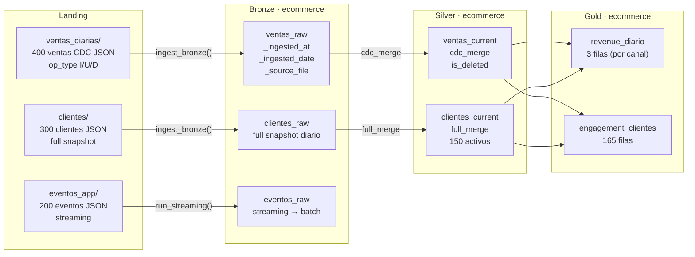

# Demo 5 — Marketplace

**Dominio:** marketplace e-commerce · **Foco:** `cdc_merge` + `full_merge` + streaming + Gold revenue/engagement

Pipeline Lakehouse completo para un marketplace con ventas CDC, catálogo de clientes y eventos de app en streaming. Produce métricas de revenue por canal y engagement por cliente en Gold.

```bash
python demos/demo_5/pipeline.py
```

---

## Flujo de datos



---

## Modelo de datos

```
FUENTE              BRONZE                SILVER              GOLD
─────────────────────────────────────────────────────────────────────
ventas CDC      →   ventas_raw        →   ventas_current  →  revenue_diario
                    (I/U/D events)        (is_deleted)       (por canal)

clientes full   →   clientes_raw      →   clientes_current → engagement_clientes
                    (snapshot diario)     (SCD1 full merge)  (por cliente_id)

eventos app     →   eventos_raw       →   (no Silver)
streaming           (streaming batch)
```

---

## Qué demuestra

| Concepto | Dónde se ve |
|---|---|
| `cdc_merge` con soft delete | `ventas_current` — `op_type I/U/D` → `is_deleted` |
| `full_merge` — catálogo clientes | `clientes_current` — snapshot diario |
| Streaming con `availableNow` | `eventos_app` — `run_streaming()` |
| Gold: revenue por canal | `revenue_diario` — SUM/COUNT/AVG por `canal` |
| Gold: engagement por cliente | `engagement_clientes` — revenue y ventas por `cliente_id` |
| Tabla de control operativo | `engine.ops.read()` — auditoría por dataset |
| Idempotencia completa | Partition overwrite Bronze + upsert Silver |

---

## Gold: métricas de negocio

### Revenue por canal

```sql
SELECT
    canal,
    COUNT(*)                        AS total_ventas,
    SUM(precio_total)               AS revenue_total,
    AVG(precio_total)               AS revenue_promedio,
    SUM(CASE WHEN estado = 'cancelado' THEN 1 ELSE 0 END) AS ventas_canceladas
FROM silver.ecommerce.ventas_current
WHERE canal IS NOT NULL
  AND (is_deleted IS NULL OR NOT is_deleted)
GROUP BY canal
ORDER BY revenue_total DESC
```

### Engagement por cliente

```sql
SELECT
    v.cliente_id,
    COUNT(v.venta_id)          AS total_ventas,
    SUM(v.precio_total)        AS revenue_cliente,
    FIRST(v.canal)             AS canal_preferido
FROM silver.ecommerce.ventas_current v
WHERE v.cliente_id IS NOT NULL
  AND (v.is_deleted IS NULL OR NOT v.is_deleted)
GROUP BY v.cliente_id
ORDER BY revenue_cliente DESC
```

---

## Control operativo

```python
# Ver auditoría de cada dataset procesado
ops_df = engine.ops.read()
ops_df.select("run_id", "dataset", "status", "rows_written", "started_at").show()
```

Salida típica:

```
+--------+-----------------+---------+------------+-------------------+
|run_id  |dataset          |status   |rows_written|started_at         |
+--------+-----------------+---------+------------+-------------------+
|abc123  |ventas_diarias   |SUCCESS  |400         |2026-05-23 10:01:00|
|abc123  |clientes         |SUCCESS  |300         |2026-05-23 10:01:05|
|abc123  |eventos_app      |SUCCESS  |200         |2026-05-23 10:01:10|
|abc123  |ventas_current   |SUCCESS  |400         |2026-05-23 10:01:20|
|abc123  |clientes_current |SUCCESS  |150         |2026-05-23 10:01:25|
+--------+-----------------+---------+------------+-------------------+
```

---

## Estructura

```
demos/demo_5/
├── pipeline.py                  # orquestador — 6 fases
├── config/
│   └── config.json
├── datagen/
│   ├── main.py
│   ├── generate_ventas.py       # 400 ventas CDC (I/U/D)
│   ├── generate_clientes.py     # 300 clientes full snapshot
│   └── generate_eventos.py      # 200 eventos app
├── ingestion/
│   ├── batch/                   # ventas_diarias.json, clientes.json
│   ├── streaming/               # eventos_app.json
│   └── silver/                  # ventas_current.json, clientes_current.json
└── tables/
    ├── bronze/                  # ventas_raw.json, clientes_raw.json
    ├── silver/                  # ventas_current.json, clientes_current.json
    └── gold/                    # revenue_diario.json, engagement_clientes.json
```

---

## Idempotencia

El pipeline puede ejecutarse múltiples veces sin efectos secundarios:

- **Bronze:** partition overwrite por `_ingested_date` — ejecutar dos veces el mismo día produce el mismo resultado
- **Silver:** MERGE INTO — los upserts no crean duplicados; los soft deletes son idempotentes
- **Streaming:** checkpoints en `{path.checkpoint}/eventos_app` — no reprocesa archivos ya ingestados
- **Gold:** `overwrite` — reemplaza completamente cada ejecución
