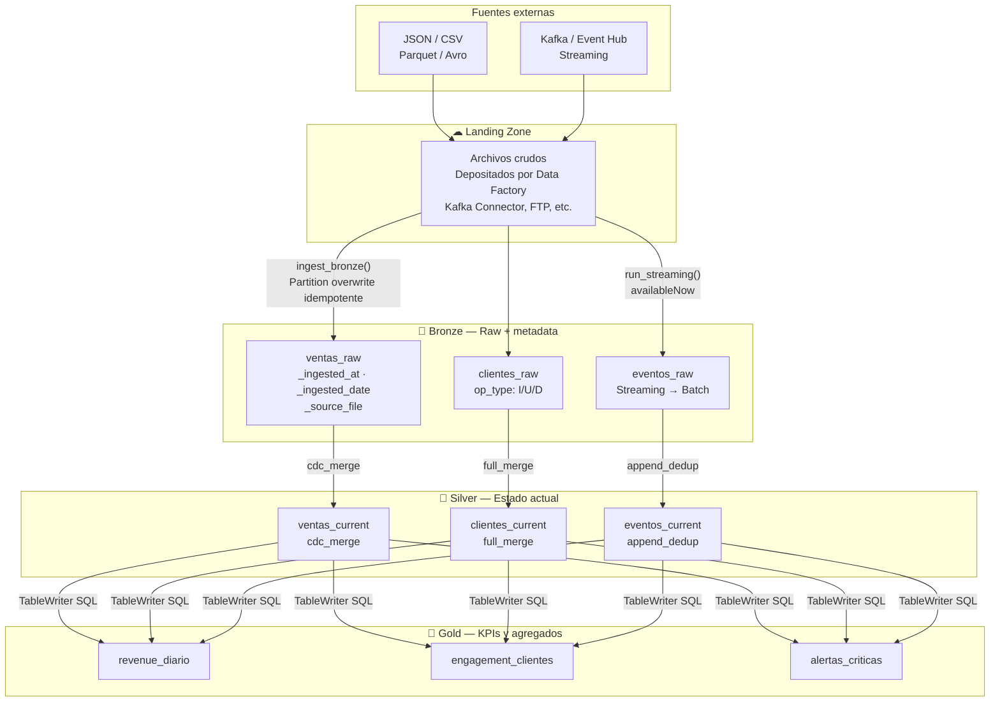
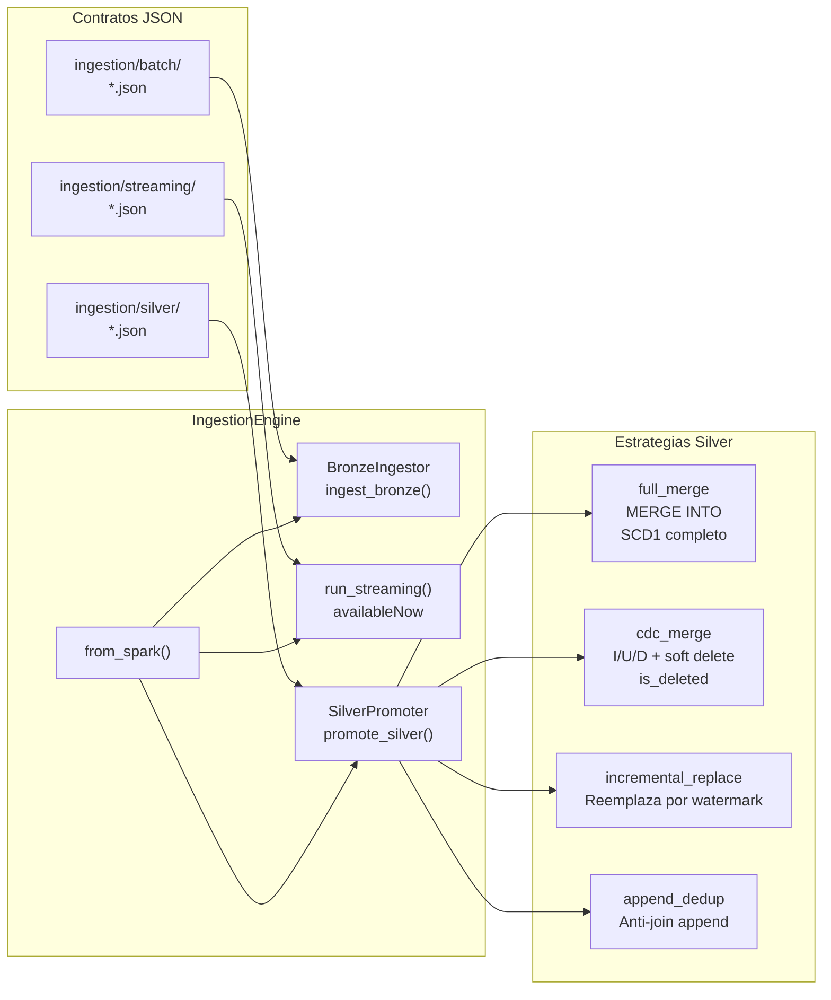
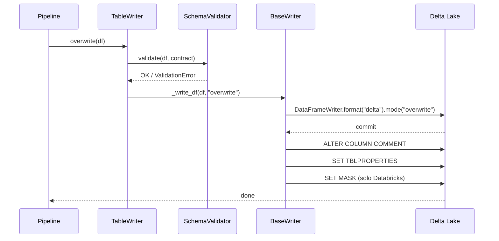
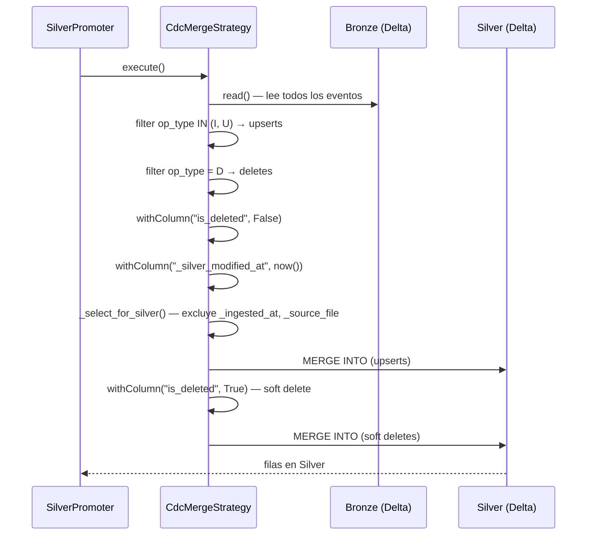
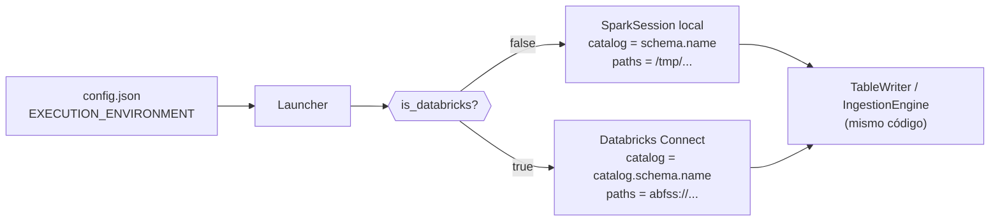

# Arquitectura

## Visión general

DKOps implementa la **arquitectura Medallion** (Landing → Bronze → Silver → Gold) con un motor de orquestación declarativo que separa la configuración del comportamiento.



---

## Módulos del framework

### Módulo 1: `ingestion` (Landing → Silver)



#### BronzeIngestor — Landing → Bronze

1. Lee archivos del directorio `source.path` del contrato
2. Añade metadatos: `_ingested_at`, `_ingested_date`, `_source_file`
3. Escribe con **partition overwrite** por `_ingested_date` → idempotente

#### SilverPromoter — Bronze → Silver

1. Lee Bronze completo (o filtrado)
2. Deduplica por `merge_keys` según `watermark_col`
3. Aplica la estrategia declarada en el contrato
4. Filtra columnas con `_select_for_silver()` — Bronze metadata no pasa a Silver
5. Añade `_silver_modified_at` si el contrato lo pide

---

### Módulo 2: `table_governance` (Silver → Gold)

```
table_governance/
├── contracts/
│   ├── loader.py          # JSON → TableContract (frozen dataclass)
│   └── validator.py       # SchemaValidator — tipos y nulabilidad
├── writers/
│   ├── table_writer.py    # ★ Fachada pública
│   ├── base_writer.py     # Bridge local ↔ Databricks + merge_schema + masks
│   ├── create_writer.py   # CREATE OR REPLACE TABLE + SET MASK
│   ├── append_writer.py   # INSERT INTO (soporta mergeSchema)
│   ├── upsert_writer.py   # MERGE INTO (SCD1)
│   ├── partition_writer.py# overwrite_partition (soporta mergeSchema)
│   └── delete_writer.py   # DELETE WHERE
└── migrations/
    └── safe_migrator.py   # Compara contrato vs estado real → ALTER TABLE
```

---

## Flujo de una escritura



---

## Flujo de promoción Silver (estrategia cdc_merge)



---

## Runtime-agnóstico: local ↔ Databricks



El `Launcher` se instancia **una vez** como singleton del proceso. Todos los writers, readers, ingestors y el `SafeMigrator` obtienen `spark` y `env` internamente vía `Launcher.current()`.

---

## Descripción de componentes

### Core

| Módulo | Responsabilidad |
|---|---|
| `Launcher` | Punto de entrada único. Detecta runtime, crea `SparkSession`, se registra como singleton. |
| `EnvironmentConfig` | Resuelve placeholders `{catalog.bronze}`, `{path.silver}` según el ambiente activo. |
| `LoggerConfig` | Logging estructurado con `loguru`. Mixin `LoggableMixin` inyecta `self.log` en cualquier clase. |

### Ingestion

| Módulo | Responsabilidad |
|---|---|
| `IngestionEngine` | Orquestador. Factory `from_spark()`. Métodos `ingest_bronze()`, `run_streaming()`, `promote_silver()`, `status()`. |
| `BronzeIngestor` | Lee archivos Landing, añade metadata, escribe Bronze con partition overwrite. |
| `SilverPromoter` | Aplica la estrategia declarada en el contrato Silver. |
| `FileReader` | Lectura batch de archivos (JSON, CSV, Parquet, Delta). |
| `FileStreamReader` | Lectura streaming — infiere schema desde archivos existentes si no se declara uno. |
| `FullMergeStrategy` | MERGE INTO Silver con dedup por watermark. SCD Type 1. |
| `CdcMergeStrategy` | Aplica I/U/D desde Bronze. Soft delete via `is_deleted`. |
| `IncrementalReplaceStrategy` | Filtra la partición más reciente del Bronze y hace upsert. |
| `AppendDedupStrategy` | Anti-join: solo inserta registros que no existen en Silver. |

### Table Governance

| Módulo | Responsabilidad |
|---|---|
| `TableContract` | Dataclass inmutable (frozen). Representa el estado deseado de una tabla. |
| `SchemaValidator` | Compara tipos Spark del DataFrame contra el contrato. Soporta widening. |
| `TableWriter` | Fachada pública: `overwrite`, `append`, `upsert`, `overwrite_partition`, `delete`. |
| `TableReader` | Lectura gobernada: `read()`, `read_partition()`, `read_stream()`, `read_cdf()`. |
| `SafeMigrator` | Compara contrato vs. tabla real. Genera plan `ALTER TABLE` sin pérdida de datos. |
