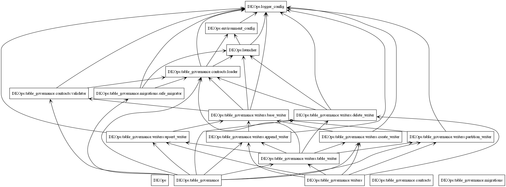
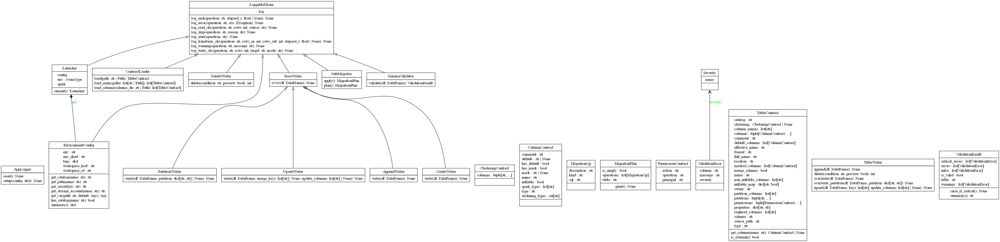

# Arquitectura

## Diagrama de paquetes



## Diagrama de clases



## Descripción de componentes

### Core

| Módulo | Responsabilidad |
|---|---|
| `Launcher` | Punto de entrada único. Detecta el runtime (local / Databricks), crea la `SparkSession` y se registra como singleton. |
| `EnvironmentConfig` | Resuelve placeholders `{catalog.bronze}`, `{path.raw}` según el workspace activo. |
| `LoggerConfig` | Logging estructurado con `loguru`. Mixin `LoggableMixin` para inyectar `self.log` en cualquier clase. |

### table_governance

```
table_governance/
├── contracts/
│   ├── loader.py     # JSON → TableContract / ColumnContract (inmutable, frozen dataclass)
│   └── validator.py  # valida tipos y nullabilidad de un DataFrame contra el contrato
├── writers/
│   ├── table_writer.py     # ★ fachada pública
│   ├── base_writer.py      # bridge local ↔ Databricks + merge_schema + masks
│   ├── create_writer.py    # CREATE OR REPLACE TABLE + SET MASK
│   ├── append_writer.py    # INSERT INTO (soporta mergeSchema)
│   ├── upsert_writer.py    # MERGE INTO (SCD1)
│   ├── partition_writer.py # overwrite_partition (soporta mergeSchema)
│   └── delete_writer.py    # DELETE WHERE
└── migrations/
    └── safe_migrator.py    # compara contrato vs estado real → plan de ALTER TABLE
```

### Flujo de una escritura

```
TableWriter.overwrite(df)
    └── CreateWriter(contract, **kwargs).write(df)
            ├── BaseWriter.__init__()          → Launcher.current() para spark/env
            ├── SchemaValidator.validate(df)   → verifica tipos y nulls
            ├── BaseWriter._write_df(df, "overwrite")
            │       ├── DataFrameWriter.format("delta").mode("overwrite")
            │       └── .option("overwriteSchema","true") si procede
            └── CreateWriter._post_write()
                    ├── _apply_column_comments()  → ALTER COLUMN COMMENT
                    ├── _apply_tblproperties()    → SET TBLPROPERTIES
                    ├── _apply_permissions()      → GRANT (solo Databricks)
                    └── _apply_column_masks()     → SET MASK (solo Databricks)
```

### Singleton Launcher

Todos los writers y el `SafeMigrator` llaman `Launcher.current()` en lugar de recibir `spark` / `env` como parámetros. Esto mantiene la API mínima:

```python
TableWriter(contract).overwrite(df)   # ← sin spark, sin env, sin config
```

El Launcher se instancia **una vez** al inicio del pipeline y queda disponible para el resto del proceso.
