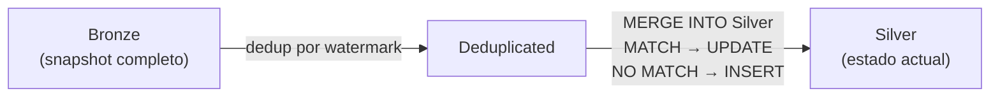
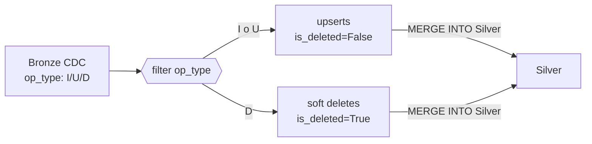
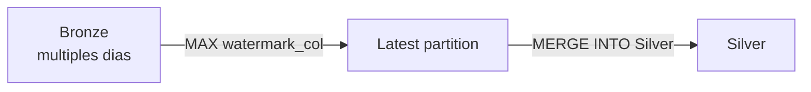
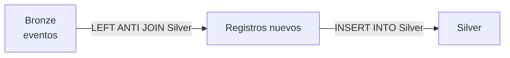

# Ingesta — Landing → Silver

El módulo `ingestion` es el corazón de DKOps. Mueve datos desde la zona de aterrizaje (Landing) hasta Silver en dos pasos: ingesta Bronze y promoción Silver.

---

## IngestionEngine

El `IngestionEngine` es el punto de entrada único. Lo construyes una sola vez con `from_spark()` y llamas a sus métodos en secuencia.

```python
from DKOps.launcher import Launcher
from DKOps.ingestion.engine import IngestionEngine

launcher = Launcher("config/config.json")

engine = IngestionEngine.from_spark(
    spark                   = launcher.spark,
    env                     = launcher.env,
    bronze_contracts_dir    = "ingestion/batch",       # contratos batch
    streaming_contracts_dir = "ingestion/streaming",   # contratos streaming (opcional)
    silver_contracts_dir    = "ingestion/silver",      # contratos Silver
    tables_base_dir         = ".",                     # base para resolver paths relativos
    ops_path                = "/tmp/ops/control",      # tabla de control operativo
)

engine.ingest_bronze()    # Landing → Bronze (batch)
engine.run_streaming()    # Landing → Bronze (streaming, availableNow)
engine.promote_silver()   # Bronze  → Silver
engine.status()           # imprime resumen de tablas
```

### Métodos

| Método | Descripción |
|---|---|
| `ingest_bronze()` | Lee archivos Landing, añade metadata, escribe Bronze. Retorna lista de fallos. |
| `run_streaming()` | Inicia queries Structured Streaming con trigger `availableNow`. Espera a que terminen. |
| `promote_silver()` | Aplica la estrategia de cada contrato Silver. Retorna lista de fallos. |
| `status()` | Imprime conteo de filas de cada tabla Bronze y Silver. |

---

## Contratos de ingesta batch (Landing → Bronze)

Los contratos batch viven en `ingestion/batch/*.json`. Cada uno describe cómo leer una fuente de Landing y dónde escribirla en Bronze.

```json
{
  "name":        "ventas_diarias",
  "ingest_type": "batch",
  "load_type":   "incremental",
  "enabled":     true,
  "source": {
    "format": "json",
    "path":   "{path.landing}/ventas_diarias"
  },
  "destination_contract": "../../tables/bronze/ventas_raw.json",
  "metadata": {
    "add_ingested_at":   true,
    "add_ingested_date": true,
    "add_source_file":   true
  }
}
```

### Campos del contrato batch

| Campo | Descripción |
|---|---|
| `name` | Nombre del dataset (aparece en logs y tabla de control) |
| `ingest_type` | `"batch"` o `"streaming"` |
| `load_type` | `"incremental"`, `"full"`, `"cdc"` |
| `enabled` | `false` salta el contrato sin error |
| `source.format` | `"json"`, `"csv"`, `"parquet"`, `"delta"` |
| `source.path` | Ruta Landing (soporta placeholders `{path.landing}`) |
| `destination_contract` | Path relativo al contrato de tabla Bronze |
| `metadata.add_ingested_at` | Añade `_ingested_at TIMESTAMP` |
| `metadata.add_ingested_date` | Añade `_ingested_date DATE` (columna de partición) |
| `metadata.add_source_file` | Añade `_source_file STRING` |

### Tipos de carga (load_type)

| Tipo | Comportamiento |
|---|---|
| `incremental` | Lee todos los archivos del directorio. Escribe con `overwrite_partition` por `_ingested_date`. Idempotente. |
| `full` | Igual que incremental — diferencia semántica para documentación. |
| `cdc` | Espera campo `op_type` con valores `I`, `U`, `D` en el origen. |

---

## Contratos streaming (Landing → Bronze)

Los contratos streaming viven en `ingestion/streaming/*.json`. Usan `readStream` con trigger `availableNow` — procesan todos los archivos pendientes y paran.

```json
{
  "name":        "eventos_app",
  "ingest_type": "streaming",
  "load_type":   "streaming",
  "enabled":     true,
  "source": {
    "format": "json",
    "path":   "{path.landing}/eventos_app"
  },
  "destination_contract": "../../tables/bronze/eventos_raw.json",
  "metadata": {
    "add_ingested_at":   true,
    "add_ingested_date": true,
    "add_source_file":   true
  }
}
```

!!! tip "Schema en streaming"
    `readStream` no soporta `inferSchema`. El `FileStreamReader` infiere el schema automáticamente leyendo los archivos existentes con `spark.read` (estático) y lo pasa al stream. Si no hay archivos aún, el schema se toma del contrato de tabla Bronze.

---

## Contratos Silver (Bronze → Silver)

Los contratos Silver viven en `ingestion/silver/*.json`. Declaran qué estrategia usar y cómo configurarla.

```json
{
  "name":        "ventas_current",
  "ingest_type": "batch",
  "strategy":    "cdc_merge",
  "enabled":     true,
  "source": { "format": "delta" },
  "source_contract":      "../../tables/bronze/ventas_raw.json",
  "destination_contract": "../../tables/silver/ventas_current.json",
  "merge_keys":    ["venta_id"],
  "watermark_col": "fecha_venta",
  "metadata": {
    "add_silver_timestamps": true
  }
}
```

### Campos del contrato Silver

| Campo | Descripción |
|---|---|
| `strategy` | `full_merge`, `cdc_merge`, `incremental_replace`, `append_dedup` |
| `source_contract` | Path al contrato de tabla Bronze |
| `destination_contract` | Path al contrato de tabla Silver |
| `merge_keys` | Clave(s) de negocio para el MERGE INTO |
| `watermark_col` | Columna para determinar el registro más reciente (dedup) |
| `metadata.add_silver_timestamps` | Añade `_silver_modified_at TIMESTAMP` |

---

## Estrategias de promoción Silver

### `full_merge` — Snapshot completo

Para catálogos y dimensiones que llegan completos cada día. MERGE INTO por `merge_keys`: actualiza existentes, inserta nuevos.



**Cuándo usarla:** catálogo de productos, dimensión de clientes, tabla de parámetros.

```json
{
  "strategy":    "full_merge",
  "merge_keys":  ["cliente_id"],
  "watermark_col": "_ingested_at"
}
```

---

### `cdc_merge` — Captura de cambios (I/U/D)

Para sistemas transaccionales que publican eventos CDC con `op_type: I | U | D`. Aplica upserts para I/U y soft deletes para D (`is_deleted = true`).



**Cuándo usarla:** tablas de ventas, pedidos, órdenes con CDC desde ERP/CRM.

```json
{
  "strategy":    "cdc_merge",
  "merge_keys":  ["venta_id"],
  "watermark_col": "fecha_venta"
}
```

La tabla Silver debe tener la columna `is_deleted BOOLEAN` en su contrato.

---

### `incremental_replace` — Partición más reciente

Lee la partición más reciente del Bronze (por `watermark_col`) y hace upsert en Silver. Útil cuando el origen publica snapshots parciales sin CDC.



**Cuándo usarla:** inventario con snapshot diario, precios actualizados.

```json
{
  "strategy":      "incremental_replace",
  "merge_keys":    ["producto_id"],
  "watermark_col": "_ingested_date"
}
```

---

### `append_dedup` — Append sin duplicados

Anti-join: inserta en Silver solo los registros que no existen por `merge_keys`. Ideal para eventos e históricos que nunca se actualizan.



**Cuándo usarla:** clickstream, logs de eventos, alertas IoT, métricas de sesión.

```json
{
  "strategy":   "append_dedup",
  "merge_keys": ["evento_id"]
}
```

---

## Metadatos Bronze

Todos los contratos batch y streaming pueden añadir estas columnas automáticamente:

| Columna | Tipo | Descripción |
|---|---|---|
| `_ingested_at` | `TIMESTAMP` | Momento exacto de la ingesta |
| `_ingested_date` | `DATE` | Fecha de ingesta — usada como **columna de partición** |
| `_source_file` | `STRING` | Nombre del archivo fuente |

El campo `_ingested_date` es especialmente importante: es la columna de partición de Bronze. Cada ejecución reemplaza solo la partición del día actual (`overwrite_partition`), garantizando **idempotencia**.

---

## Metadatos Silver

Cuando `add_silver_timestamps: true`, todas las estrategias añaden:

| Columna | Tipo | Descripción |
|---|---|---|
| `_silver_modified_at` | `TIMESTAMP` | Última vez que se modificó la fila en Silver |

La estrategia `cdc_merge` también gestiona:

| Columna | Tipo | Descripción |
|---|---|---|
| `is_deleted` | `BOOLEAN` | `true` = registro eliminado (soft delete) |

---

## Tabla de control operativo

El engine registra cada ejecución en una tabla Delta en `ops_path`. Puedes consultarla para auditoría y monitoreo:

```python
ops_df = engine.ops.read()
ops_df.select("run_id", "dataset", "status", "rows_written", "started_at").show()
```

---

## Batch vs. Streaming

| | Batch | Streaming |
|---|---|---|
| **Trigger** | `spark.read` estático | `readStream` + `availableNow` |
| **Escala** | Todos los archivos del directorio | Archivos nuevos desde el último checkpoint |
| **Checkpoint** | No — idempotente por partition overwrite | Sí — en `{path.checkpoint}/{name}` |
| **Latencia** | Minutos a horas | Segundos a minutos |
| **Casos de uso** | Cargas diarias, ETL nocturno | Clickstream, IoT, eventos en tiempo real |

!!! note "availableNow en producción"
    `run_streaming()` usa `trigger(availableNow=True)`. El stream procesa todos los archivos pendientes y termina solo — comportamiento idéntico al batch pero con la semántica de checkpoint de Structured Streaming. En Databricks se puede reemplazar por Auto Loader para mayor escalabilidad.

---

## Configuración de placeholders

Los contratos de ingesta soportan los mismos placeholders que los contratos de tabla:

| Placeholder | Resuelve a |
|---|---|
| `{path.landing}` | Ruta de la zona Landing |
| `{path.bronze}` | Ruta de la zona Bronze |
| `{path.silver}` | Ruta de la zona Silver |
| `{path.checkpoint}` | Ruta para checkpoints de streaming |
| `{catalog.bronze}` | Catálogo Bronze del ambiente activo |
| `{catalog.silver}` | Catálogo Silver del ambiente activo |
| `{env}` | Nombre del ambiente (`local`, `dev`, `prod`) |
