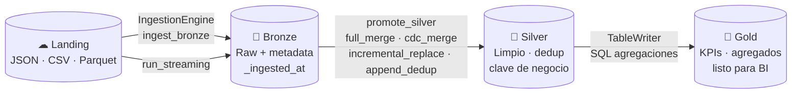

# DKOps

**Framework de gobierno Delta y orquestación de pipelines Spark — el mismo código corre en local y en Databricks.**

---

## ¿Qué es DKOps?

DKOps profesionaliza la construcción de pipelines de datos sobre **Apache Spark + Delta Lake** siguiendo la arquitectura Lakehouse Medallion.

Resuelve los problemas que aparecen cuando un equipo crece más allá de los "scripts sueltos":

| Problema | Solución DKOps |
|---|---|
| Schema enterrado en código | Contratos JSON versionados con validación automática |
| Pipelines frágiles ante cambios de schema | `SafeMigrator` + `merge_schema` |
| Lógica de ingesta duplicada por dataset | `IngestionEngine` con estrategias declarativas |
| Código diferente para local y Databricks | Runtime detector — mismo código, sin `if env:` |
| Falta de visibilidad operativa | Tabla de control operativo + `status()` |

---

## Flujo completo: Landing → Bronze → Silver → Gold



---

## Quickstart — IngestionEngine

=== "Batch (diario)"

    ```python
    from DKOps.launcher import Launcher
    from DKOps.ingestion.engine import IngestionEngine

    launcher = Launcher("config/config.json")

    engine = IngestionEngine.from_spark(
        spark                = launcher.spark,
        env                  = launcher.env,
        bronze_contracts_dir = "ingestion/batch",
        silver_contracts_dir = "ingestion/silver",
        tables_base_dir      = ".",
        ops_path             = "/tmp/ops/control",
    )

    engine.ingest_bronze()    # Landing  → Bronze
    engine.promote_silver()   # Bronze   → Silver
    engine.status()           # Resumen del lakehouse
    ```

=== "Streaming (continuo)"

    ```python
    from DKOps.launcher import Launcher
    from DKOps.ingestion.engine import IngestionEngine

    launcher = Launcher("config/config.json")

    engine = IngestionEngine.from_spark(
        spark                   = launcher.spark,
        env                     = launcher.env,
        streaming_contracts_dir = "ingestion/streaming",
        silver_contracts_dir    = "ingestion/silver",
        tables_base_dir         = ".",
        ops_path                = "/tmp/ops/control",
    )

    engine.run_streaming()    # Structured Streaming — availableNow
    engine.promote_silver()   # Bronze → Silver
    ```

---

## Quickstart — TableWriter / TableReader

```python
from DKOps.launcher import Launcher
from DKOps.table_governance import load_contract, TableWriter, TableReader

launcher = Launcher("config/config.json")
contract = load_contract("tables/silver/ventas_current.json")

# Escribir
TableWriter(contract).overwrite(df)                       # CREATE OR REPLACE
TableWriter(contract).upsert(df, keys=["venta_id"])       # MERGE INTO
TableWriter(contract).append(df_nuevos)                   # INSERT INTO

# Leer
df = TableReader(contract).read()                         # Tabla completa
df = TableReader(contract).read(filter="estado = 'activo'")
df = TableReader(contract).read_cdf(starting_version=1)   # Change Data Feed
```

---

## Módulos principales

=== "Ingesta (Landing → Silver)"

    ```
    DKOps/ingestion/
    ├── engine.py              # IngestionEngine — orquestador principal
    ├── ingestors/
    │   ├── bronze_ingestor.py # Landing → Bronze (batch)
    │   └── silver_promoter.py # Bronze  → Silver (4 estrategias)
    ├── readers/
    │   ├── file_reader.py     # Lectura batch de archivos
    │   └── file_stream.py     # Lectura streaming (auto-schema inference)
    ├── strategies/
    │   ├── full_merge.py      # MERGE INTO — snapshot completo
    │   ├── cdc_merge.py       # CDC I/U/D con soft delete
    │   ├── incremental_replace.py  # Reemplaza por watermark
    │   └── append_dedup.py    # Anti-join append
    └── contracts/
        └── ingestion_contract.py   # Modelo de contrato de ingesta
    ```

=== "Gobierno de tablas (Silver → Gold)"

    ```
    DKOps/table_governance/
    ├── contracts/
    │   ├── loader.py          # JSON → TableContract (frozen dataclass)
    │   └── validator.py       # Validación de tipos y nulabilidad
    ├── writers/
    │   ├── table_writer.py    # ★ Fachada pública
    │   ├── create_writer.py   # CREATE OR REPLACE TABLE
    │   ├── append_writer.py   # INSERT INTO (mergeSchema)
    │   ├── upsert_writer.py   # MERGE INTO
    │   ├── partition_writer.py# overwrite_partition
    │   └── delete_writer.py   # DELETE WHERE
    └── migrations/
        └── safe_migrator.py   # Compara contrato vs estado real
    ```

---

## Características

- **Contratos JSON** — schema, particiones, permisos y metadatos versionados con el código
- **Motor de ingesta declarativo** — 4 estrategias de promoción Silver configurables desde JSON
- **Batch y Streaming unificados** — mismo engine, trigger `availableNow` para modo micro-batch
- **Runtime-agnóstico** — detección automática local / Databricks vía `config.json`
- **Validación de schema** — verifica tipos y nulabilidad antes de cada escritura
- **Migraciones seguras** — `SafeMigrator` planifica `ALTER TABLE` sin pérdida de datos
- **Tabla de control operativo** — cada ejecución registra dataset, filas, estado y timestamp
- **Logging estructurado** — `loguru` en cada operación con duración y filas
