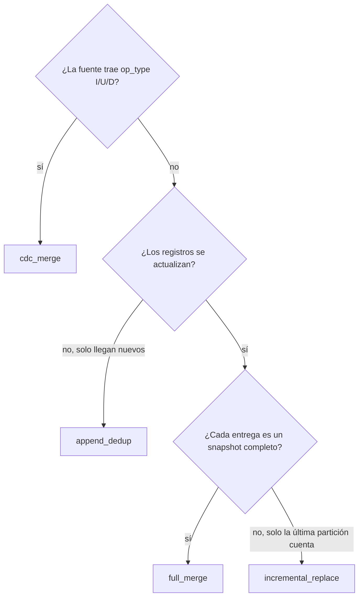

# Promoción a Silver

Los contratos de promoción viven en `ingestion/silver/`. Indican de qué tabla Bronze
leer, en qué tabla Silver escribir y cómo fusionar los datos.

## Ejemplo

```json title="ingestion/silver/ventas_current.json"
{
  "name":     "ventas_current",
  "strategy": "cdc_merge",
  "enabled":  true,
  "source":   { "format": "delta" },
  "source_contract":      "../../tables/bronze/ventas_raw.json",
  "destination_contract": "../../tables/silver/ventas_current.json",
  "merge_keys":    ["venta_id"],
  "watermark_col": "fecha_venta",
  "metadata": {
    "add_silver_timestamps": true
  }
}
```

La presencia del campo `strategy` es lo que convierte a un contrato de ingesta en una
promoción a Silver.

## Campos

| Campo | Obligatorio | Descripción |
|---|---|---|
| `name` | Sí | Identificador del dataset. |
| `strategy` | Sí | `full_merge`, `cdc_merge`, `incremental_replace` o `append_dedup`. |
| `source_contract` | Sí | Contrato de la tabla Bronze de origen. |
| `destination_contract` | Sí | Contrato de la tabla Silver de destino. |
| `merge_keys` | Según estrategia | Clave de negocio. Obligatoria en `full_merge`, `cdc_merge` y `append_dedup`. |
| `watermark_col` | No | Columna que indica cuál es el registro más reciente de cada clave. |
| `filter` | No | Expresión SQL aplicada al leer Bronze. |
| `source` | No | Basta con `{"format": "delta"}`; la tabla real sale de `source_contract`. |
| `metadata.add_silver_timestamps` | No | Añade `_silver_created_at` y `_silver_modified_at`. |

## Qué estrategia elegir



| Estrategia | Caso típico |
|---|---|
| `full_merge` | Catálogos y dimensiones que llegan completos |
| `cdc_merge` | Pedidos u órdenes con eventos de cambio desde un ERP o CRM |
| `incremental_replace` | Inventario o precios con un snapshot por día |
| `append_dedup` | Clickstream, logs, alertas de IoT |

El detalle de cada una está en [Estrategias](strategies.md).
