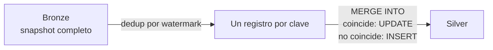
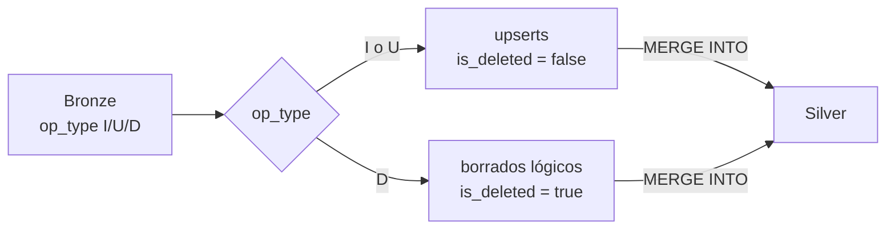
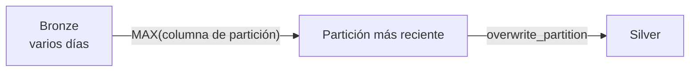
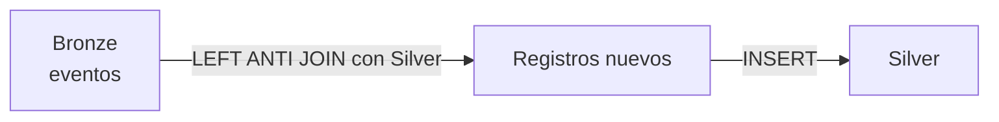

# Estrategias

Cada estrategia define cómo se fusionan los datos de Bronze con lo que ya existe en
Silver. Todas deduplican antes de escribir y todas son idempotentes.

## full_merge

Pensada para catálogos y dimensiones que llegan completos en cada entrega. Hace un
`MERGE INTO` por `merge_keys`: actualiza las filas que ya existen e inserta las nuevas.
Equivale a un SCD tipo 1.



```json
{
  "strategy":      "full_merge",
  "merge_keys":    ["cliente_id"],
  "watermark_col": "_ingested_at"
}
```

**Úsala para** catálogos de productos, dimensiones de clientes o tablas de parámetros.

---

## cdc_merge

Para sistemas transaccionales que publican eventos de cambio con `op_type`. Los eventos
`I` y `U` se aplican como upsert y los `D` como borrado lógico, marcando
`is_deleted = true`.



```json
{
  "strategy":      "cdc_merge",
  "merge_keys":    ["venta_id"],
  "watermark_col": "fecha_venta"
}
```

!!! note "Requisito del contrato de tabla"

    La tabla Silver debe declarar la columna `is_deleted` de tipo `BOOLEAN`. Recuerda
    filtrarla en tus consultas de Gold: `WHERE is_deleted IS NULL OR NOT is_deleted`.

**Úsala para** ventas, pedidos u órdenes que vienen de un ERP o CRM con CDC.

---

## incremental_replace

Toma la partición más reciente de Bronze y con ella reemplaza la partición equivalente
de Silver. Cada partición se considera autocontenida, así que no hay merge por clave.

La columna de partición es `watermark_col`; si no se indica, se usa la primera columna
de partición de la tabla Silver y, en último caso, `_ingested_date`.



```json
{
  "strategy":      "incremental_replace",
  "watermark_col": "_ingested_date"
}
```

**Úsala para** inventario con un snapshot diario, stock o listas de precios que se
regeneran completas cada día.

---

## append_dedup

Inserta en Silver solo los registros cuya clave todavía no existe, mediante un anti-join.
Nunca actualiza filas.



```json
{
  "strategy":   "append_dedup",
  "merge_keys": ["evento_id"]
}
```

**Úsala para** clickstream, logs de eventos, alertas de IoT o métricas de sesión.

---

## Comparativa

| | Actualiza filas | Borra | Necesita `merge_keys` | Necesita `watermark_col` |
|---|---|---|---|---|
| `full_merge` | Sí | No | Sí | Recomendado |
| `cdc_merge` | Sí | Borrado lógico | Sí | Recomendado |
| `incremental_replace` | Reemplaza la partición | No | No | Recomendado |
| `append_dedup` | No | No | Sí | No |

Si ninguna encaja con tu caso, puedes añadir una estrategia propia heredando de
`BasePromotionStrategy`. La [referencia de estrategias](../api/ingestion/strategies.md)
documenta las clases existentes.
